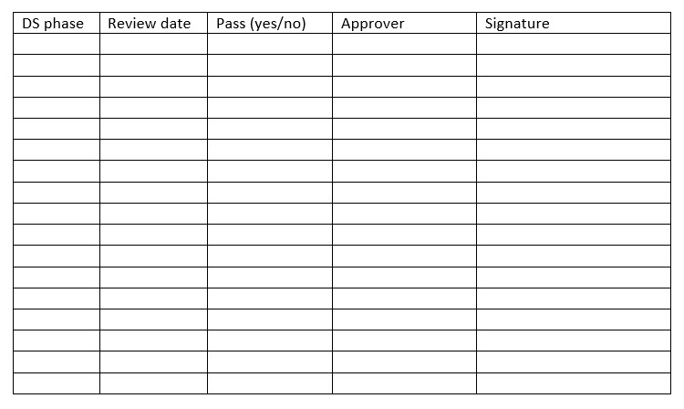
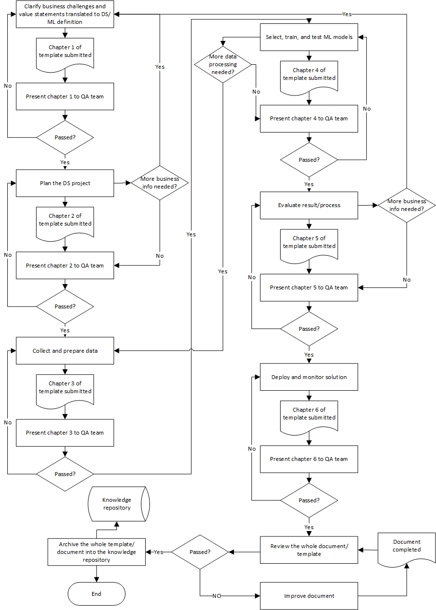

# Equinor Data Science Process Standard

* * *
## Introduction
This DS process standard takes the form of a template. Each DS project shall complete this template to make sure that DS project in Statoil can deliver value to business to the maximal extent.
 
The document is structured into 6 sections according to the 6 DS phases: 
* Business understanding and problem definition
* Project planning
* Collecting and preparing data
* Modeling
* Evaluation
* Deployment and monitoring

For each phase, a set of tasks are identified. A group of questions are listed under each task. These questions are designed to guide DS teams to carry out DS projects in a standard way.

The DS team shall complete all the questions as a joint effort of the whole team. The answers for each phase shall be reviewed/approved by QA team (for example, DS VP, PM, DS discipline advisor, Peers, Stakeholders) before the project moves to the next phase (Table 1. shall contain the review/approval records for each phase). The questions answered in previous iterations shall be updated if needed, and the updated document shall be reviewed and approved. 

DS project leader (DS team responsible) owns (is responsible for completing) this document. 

Figure 1. shows the adopted data science process phases, and the document/quality control process is plotted in the middle. A more detailed document/quality control flowchart is illustrated in Figure 2. 

The document shall be added to the script that populates the [knowledge repository](https://git.statoil.no/DataScience/projects) to ease future knowledge sharing.

* * *
**Table 1.** Data Science phase review/approval table

* * *

**Figure 1.** Data Science process diagram

_ _ _

**Figure 2.** Data Science process FlowChart

_ _ _

## 1 Business Understanding and Problem Definition

### 1.1 Connecting business
#####   1.1.1 Who is the sponsor?
##### 	1.1.2 What is the business organization chart?
##### 	1.1.3	What is the business goal/objective?
##### 	1.1.4	What is the business strategy?
##### 	1.1.5	What is the business process?
##### 	1.1.6	How is the business efficiency measured?
##### 	1.1.7	Who is the main contact person?
##### 	1.1.8	Who is the SME?
##### 	1.1.9	Who is the end user?

### 	1.2	Understanding business challenge
##### 	1.2.1	What is the business challenge/pain point/bottleneck?
##### 	1.2.2	What are the identified use cases?
##### 	1.2.3	Has the discovery workshop been executed, and what is the result?
##### 	1.2.4	What is the current solution / how might a theoretical human “expert” perform the task today?
##### 	1.2.5	If your human expert were to perform this task, how would you respond to them so they improved for the next time? For classification, do this for all four phases of a typical confusion matrix (e.g. true / false)
##### 	1.2.6	If a human were to perform this task, what assumptions would the user want them to make?
##### 	1.2.7	What are the constraints?

###	1.3	Identifying requirements
##### 	1.3.1	What are the functional requirements?
##### 	1.3.2	What are the identified end user UX requirements?
##### 	1.3.3	How should the potential solution fit into the business process?
##### 	1.3.4	What is the solution delivery deadline?

###	1.4	Discovering data
##### 	1.4.1	What data do you need ideally to solve the problem?
##### 	1.4.2	What data is available?
##### 	1.4.3	Have you use Statoil data catalog for data discovering [link to data catalog](https://eun-su1.azuredatacatalog.com/#/home)?
##### 	1.4.4	What is the data format e.g. structured in Database, free text or image?
##### 	1.4.5	Who owns the data?
##### 	1.4.6	How is the data accessed?
##### 	1.4.7	Who is the contact person to access the data?
##### 	1.4.8	What are the risks for accessing, understanding, analyzing the data?
##### 	1.4.9	What is the effort estimation for data collecting and preparing for each data source?
##### 	1.4.10	What are the data governance issues?
##### 	1.4.11	How is each use case/process/entity covered by the discovered data?

###	1.5	Identifying DS opportunity
##### 	1.5.1	What is the problem type from DS perspective, e.g. regression, classification, clustering etc.? 
##### 	1.5.2	What is the problem-solving process from DS perspective (solution framework)?
##### 	1.5.3	What are the previous relevant experience/components that can be reused?
##### 	1.5.4	Has the feasibility study been done? What is the result?
##### 	1.5.5	What is the business value the DS solution can bring?
##### 	1.5.6	What is the consequence of a potential DS solution error? How can we control it?
##### 	1.5.7	How can the DS solution fit into the business process?
##### 	1.5.8	What are the main risks to fail? How can we control them?
##### 	1.5.9	What is the feedback from SME on the proposed DS solution?

###	1.6	Setting success/stop criteria
##### 	1.6.1	What is the evaluation strategy, objective evaluation or subjective evaluation?
##### 	1.6.2	What is the objective success criteria (recall, precision, accuracy, etc.)?
####	1.6.3	What is the subjective success criteria?
####	1.6.4	What is the stop criteria?
####	1.6.5	Have success/stop criteria communicated and agreed with stakeholders?
####	1.6.6	Is insufficient SME involvement part of the stop criteria? What has been agreed on with respect to the SME involvement and SME experience level?

###	1.7	Document review and artifact archiving
####	1.7.1	Has the document (answers to the questions) in this phase been reviewed and approved? If not, document the reason. (this question shall be answered the same number of times as the document review rounds for this phase) 
####	1.7.2	What artifacts (document, code and data) are achieved in this phase? How are they archived for reuse and future reference? 

##	2	Project Planning

###	2.1	Resource planning
####	2.1.1	What is the competence and resource plan?
####	2.1.2	What are the competences needed (competence matrix)?
####	2.1.3	How can team members meet the competence matrix?
####	2.1.4	Does team include the following roles: data scientist, ML engineer, and data engineer?
####	2.1.5	Are there dedicated SMEs allocated for the project?
####	2.1.6	What is the cooperation model with SME and end user?

###	2.2	Time planning
####	2.2.1	What is the time plan?
####	2.2.2	How is the DS time plan aligned with main project plan (if relevant)?
####	2.2.3	How does DS iterations fit into the time plan?
####	2.2.4	What are the definition of project phases/steps and what are milestones for them?
####	2.2.5	What are the risks to follow the plan? How can the risks be controlled?
####	2.2.6	What is the feedback from stakeholders on time plan?

###	2.3	Process planning
####	2.3.1	What is the scope of the DS project?
####	2.3.2	Is the DS project a standalone process or running parallel with a bigger SW implementation project where DS solution is part of?
####	2.3.3	If parallel, what are the cooperation model between the main process and the DS process?
####	2.3.4	If parallel, has DS project research/iteration feature communicated with the main project management?
####	2.3.5	Do you follow the rule: start with simple, get value into business and iteration for improvement?
####	2.3.6	How are the DS iterations planned in the project?
####	2.3.7	What is the plan to build up pipeline as early as possible to speed up the iteration?
####	2.3.8	Is Kanban agile project process considered as the first option? If not, why?
####	2.3.9	What is the feedback loop from stakeholders?
####	2.3.10	How can the results from each phase be reviewed by stakeholders?
####    2.3.11  Has an architecture contract been completed?

###	2.4	DS tools planning
####	2.4.1	What tools/platforms/systems are planned to be used in the DS project?
####	2.4.2	Are there experience/competence gap to use these tools? If yes, what is the plan to close the gap?
####	2.4.3	Are all the tools standard tools according to the DCOE DS tech standard? If not, why? ([link to the standard wiki page](https://wiki.statoil.no/wiki/index.php/Statoil_Data_Science_Technical_Standards))
####	2.4.4	What is the plan for code/document review, artifact archiving, and knowledge sharing?

###	2.5	Document review and artifact archiving
####	2.5.1	Has the document (answers to the questions) in this phase been reviewed and approved? If not, document the reason. (this question shall be answered the same number of times as the document review rounds for this phase) 
####	2.5.2	What artifacts (document, code and data) are achieved in this phase? How are they archived for reuse and future reference?

##	3	Data collecting and preparing

###	3.1	Collecting data
####	3.1.1	What are the rules to select relevant and irrelevant data?
####	3.1.2	What is the frequency/granularity the data is collected? Is it enough for the target problem?
####	3.1.3	Is the raw data kept untouched after collection?
####	3.1.4	Is the data to be stored in the data platform? If not, why?
####	3.1.5	Is open data format used to store the data, for example, txt, json, csv? If not, why?
#### 3.1.6 Is an automated pipeline set up for processing new data? If not, why?
####	3.1.7	Document the data collection process?

###	3.2	Exploring data
####	3.2.1	What is the structure of the data?
####	3.2.2	What are the relationships between data items?
####	3.2.3	How are the data from different source mapped together?
####	3.2.4	What tools, statistical methods, visualization tools have been used to explore the data?
####	3.2.5	What is the data quality: completeness, consistency, validity, and accuracy?
####	3.2.6	What are the other issues with data quality?
####	3.2.7	How should duplicated data be filtered or removed?
####	3.2.8	Are there outliers in the data?
####	3.2.9	What patterns have you found in the data?

###	3.3	Understanding data from domain
####	3.3.1	How was the data generated?
####	3.3.2	How was the data sampled/transferred?
####	3.3.3	What is the meaning of each data item from business perspective?
####	3.3.4	What is the relationship between each data item and the target output?
####	3.3.5	Are there unstable data period, how to identify and remove?
####	3.3.6	Are all the identified outliers noise?
####	3.3.7	What is the valid data range for each data item?

###	3.4	Preparing data
####	3.4.1	What is the plan to prepare the data?
####	3.4.2	What is the feedback from SME on the data preparation plan?
####	3.4.3	How is missing data filled/removed?
####	3.4.4	How is noise data removed/replaced?
####	3.4.5	How is the overlapped data combined/filtered/removed?
####	3.4.6	How the data is transformed?
####	3.4.7	How are training, validation and test dataset split?

###	3.5	Feature engineering
####	3.5.1	Is ML method used to reduce the complexity of the input feature space, for example, PCA or autoencoder?
####	3.5.2	What are the useful domain characteristics that are not represented in the dataset?
####	3.5.3	What features can be identified/created to represent the identified missing characters?

###	3.6	Document review and artifact archiving
####	3.6.1	Has the document (answers to the questions) in this phase been reviewed and approved? If not, document the reason. (this question shall be answered the same number of times as the document review rounds for this phase) 
####	3.6.2	What artifacts (document, code and data) are achieved in this phase? How are they archived for reuse and future reference?

##	4	Modeling

###	4.1	Selecting model
####	4.1.1	What DS models have been considered, and what are the ones chosen for further evaluation?
####	4.1.2	What are the advantages and disadvantages of the chosen models?
####	4.1.3	Is the simplest model chosen as benchmark in the first iteration?
####	4.1.4	What is the criteria to compare candidate models?

###	4.2	Building model
####	4.2.1	What are the hyper-parameters for the selected models?
####	4.2.2	What are the processes to optimize the hyper-parameters?
####	4.2.3	Has the data been normalized? Give explanation.
####	4.2.4	What is the time used to train the model? Is it acceptable for offline or online training?

###	4.3	Testing model
####	4.3.1	Is separate test dataset used to test models?
####	4.3.2	Are success criteria met by models? 
####	4.3.3	How easily can the end user use/understand model output?
####	4.3.4	Is model performance part of the criteria?
####	4.3.5	What is the subjective evaluation result?
####	4.3.6	If more than one models meet the criteria, how should one/ones have chosen from them? 

###	4.4	Document review and artifact archiving
####	4.4.1	Has the document (answers to the questions) in this phase been reviewed and approved? If not, document the reason. (this question shall be answered the same number of times as the document review rounds for this phase) 
####	4.4.2	What artifacts (document, code and data) are achieved in this phase? How are they archived for reuse and future reference?

##	5	Evaluation

###	5.1	Technical evaluation
####	5.1.1	Have predefined success/acceptance criteria been met by the chosen model?
####	5.1.2	Have all the identified requirements been met? 
####	5.1.3	Have all the identified use cases been covered?
####	5.1.4	What are the preconditions and limitations of the chosen model? 
####	5.1.5	How easily can the model be integrated into the work process?
####	5.1.6	What are the end user competence needed to use the model? Is this competence requirement acceptable by the end user organization?
####	5.1.7	Has the business changed so that the solution cannot be applied anymore?

###	5.2	Process evaluation
####	5.2.1	Has the planned artifact peer review been executed as planed?
####	5.2.2	Have the communication channels with stakeholders worked as expected?
####	5.2.3	Has the time plan been met? If not, why?
####	5.2.4	Have all the relevant documents been in place and approved?
####	5.2.5	What is the go/no-go decision and reason behind it?
####	5.2.6	What is the feedback from SME or end user on the evaluation result?

###	5.3	Document review and artifact archiving
####	5.3.1	Has the document (answers to the questions) in this phase been reviewed and approved? If not, document the reason. (this question shall be answered the same number of times as the document review rounds for this phase) 
####	5.3.2	What artifacts (document, code and data) are achieved in this phase? How are they archived for reuse and future reference?

##	6	Deployment and Monitoring

###	6.1	Deploying model
####	6.1.1	How is the chosen model implemented/deployed?
####	6.1.2	How is the result to be presented to the end user? Is there a graphic way to do it?
####	6.1.3	If deployed as SW, does the Statoil architecture contract been met?
####	6.1.4	Which TRL (Technology readiness level) level is the SW classified as?
####	6.1.5	How are the results to be interpreted or utilized?
####	6.1.6	Are there IP governance issues?

###	6.2	Managing the process change
####	6.2.1	What are the changes the new DS solution brings to the business process?
####	6.2.2	What are the efforts/process to adopt the new solution by the management?
####	6.2.3	What effort is used to train the end user to use the new solution?

###	6.3	Monitoring and maintaining DS model
####	6.3.1	What is the operation/maintenance plan for the DS solution?
####	6.3.2	How often shall the model be re-trained and re-deployed? Automatically or manually?
####	6.3.3	What is the usage monitoring plan for the DS solution?
####	6.3.4	Are the DS solution constraints/limitations under monitoring?
####	6.3.5	What is the user feedback loop?

###	6.4	Knowledge sharing
####	6.4.1	What can be learned from the project process?
####	6.4.2	How can the experience be shared with others and retrieved for future reference?
####	6.4.3	What DS components (knowledge, product, process and data) can we reuse or share?
####	6.4.4	What improvement suggestions do you have for this DS standard template?

###	6.5	Document review
####	6.5.1	Has the document (answers to the questions) in this phase been reviewed and approved? If not, document the reason. (this question shall be answered the same number of times as the document review rounds for this phase)
